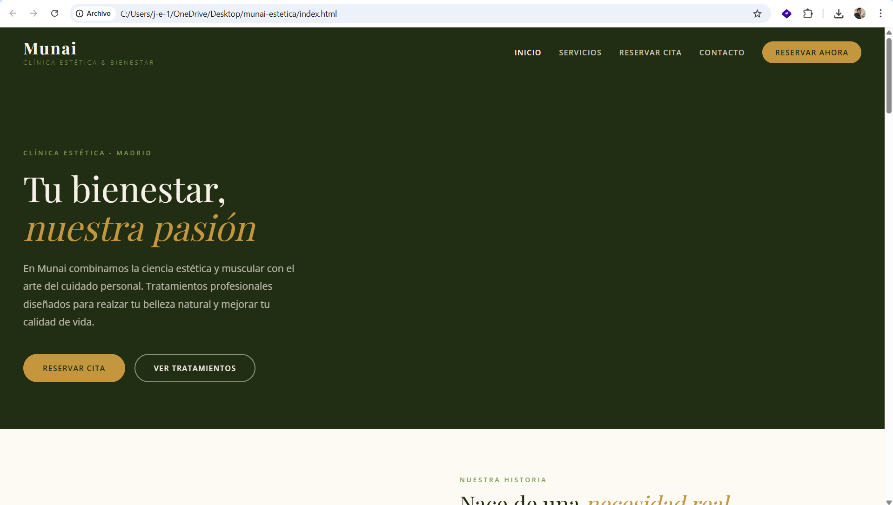
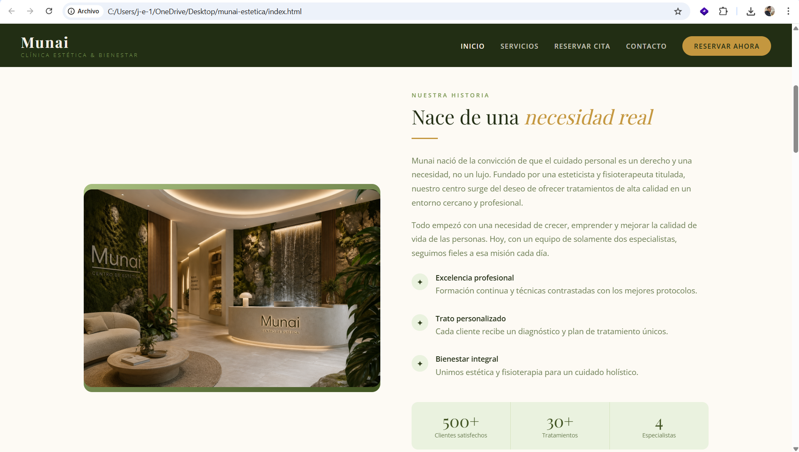
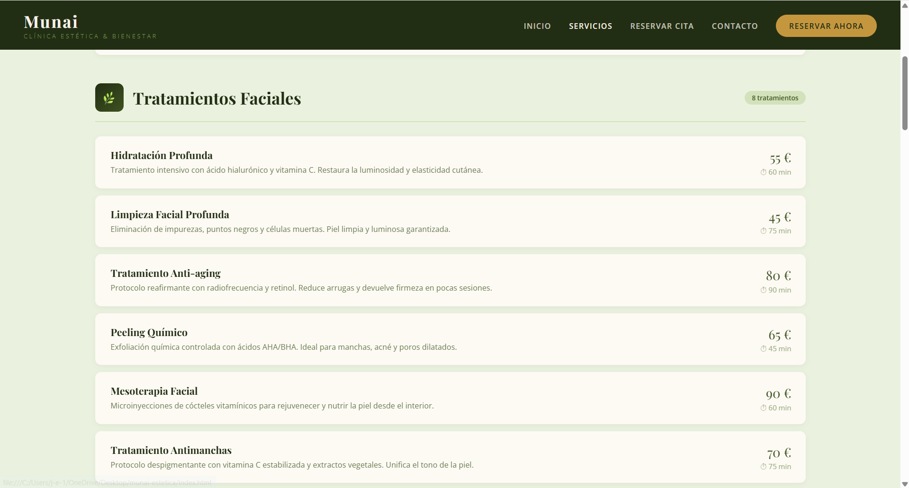
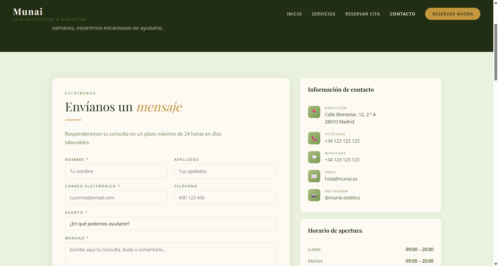

# Portfolio — Jose Enrique Alonso B.

Estudiante de 1º DAW · Proyecto Intermodular 2026

---

## Proyecto principal: Munai Clínica Estética

**Munai** es un portal web corporativo desarrollado con HTML5 y CSS3 para una clínica estética y de fisioterapia ficticia.

**Repositorio:** https://github.com/JoseeAlonso/Munai_Estetica_DAW.git

---

## Capturas del proyecto






| Página | Descripción |
|---|---|
| `index.html` | Página de inicio con hero, equipo y servicios |
| `servicios.html` | Catálogo de tratamientos con precios |
| `citas.html` | Formulario de reserva en 5 pasos |
| `contacto.html` | Datos, horarios, FAQ y privacidad |

---

## Estructura del proyecto

```
munai/
├── index.html
├── servicios.html
├── citas.html
├── contacto.html
├── css/
│   ├── base.css
│   ├── nav.css
│   ├── footer.css
│   ├── botones.css
│   ├── inicio.css
│   ├── hero-pagina.css
│   ├── servicios.css
│   ├── formularios.css
│   ├── citas.css
│   └── contacto.css
├── img/
└── docs/
    ├── LM/
    └── empleabilidad/
```

---

## ¿Cómo abrirlo?

1. Clona o descarga el repositorio.
2. Abre `index.html` directamente en tu navegador.
3. Navega entre páginas desde el menú superior.

No requiere servidor ni instalación de ningún tipo.

---

## Lo que he aprendido con este proyecto

- A escribir HTML semántico de forma correcta usando `header`, `nav`, `main`, `section`, `article` y `footer`
- A maquetar con Flexbox sin depender de frameworks
- A dividir el CSS en archivos independientes organizados por sección
- A hacer una web responsive con media queries desde un enfoque mobile-first
- A construir formularios con diferentes tipos de campos y validación HTML5
- A mantener un repositorio de GitHub con commits descriptivos y una estructura de carpetas clara
- A conectar el diseño de una web con la estructura de una base de datos real
- Crear funcionalidades para la lógica del desarrollo
